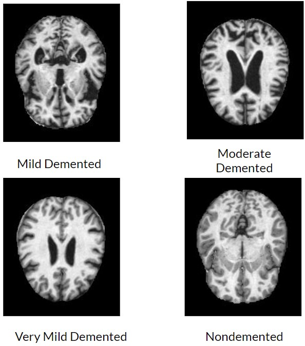
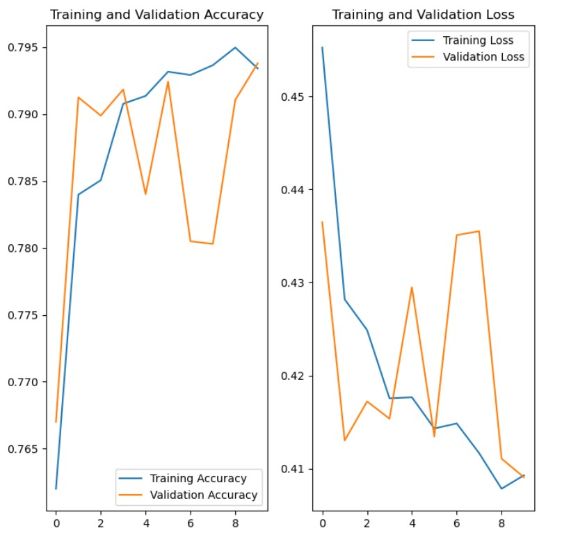
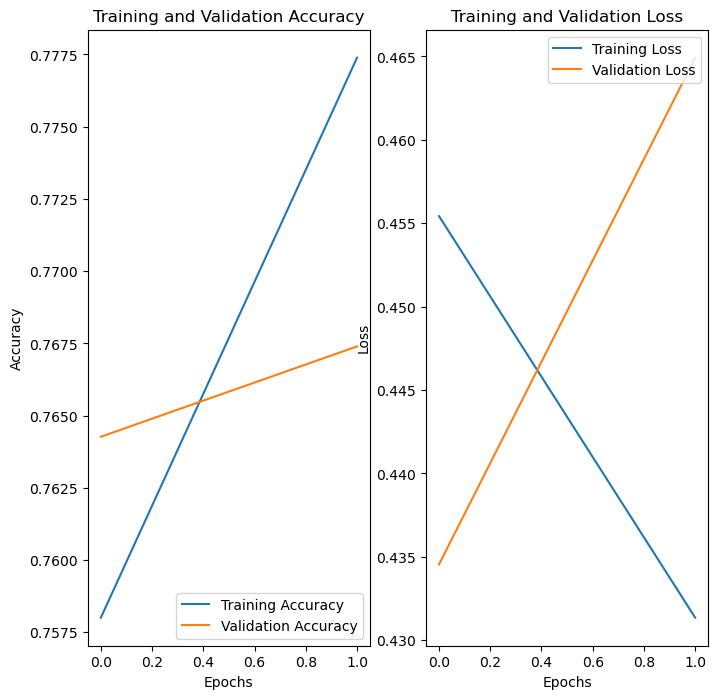
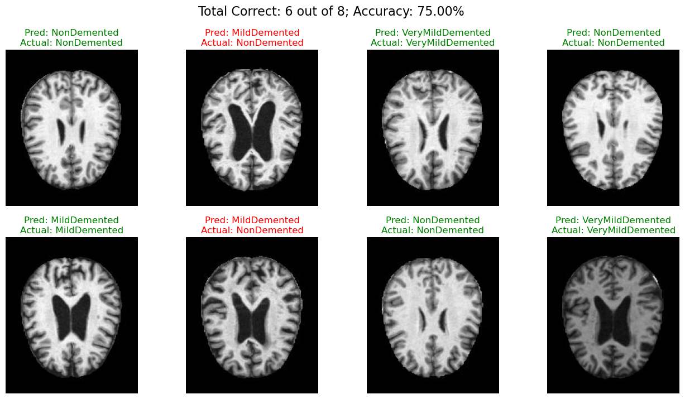
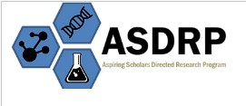

# Using Machine Learning to Identify Alzheimer's Disease in the Initial Stages

This repository contains a TensorFlow-based image classification model designed for identifying different stages of Alzheimer's disease:
 
 

## Model Overview


The model is built using TensorFlow and Keras, with a Sequential Model containing convolutional layers, max pooling, dropout, and dense layers. The final layer uses a softmax activation function for multi-class classification.

<span style="color:blue">BinaryCrossentropy was chosen over CategoricalCrossentropy to improve the accuracy and efficiency of the model. Additionally, BinaryCrossEntropy takes classes independently and trains them, allowing it to go beyond classifying a Detected/Non-detected scenario. </span>
 

### Key Features:

- Data augmentation for training diversity
- Sequential model with Conv2D, MaxPooling2D, and Dense layers
- Softmax activation for multi-class classification
- SGD optimizer with learning-rate scheduler

## Training Graphs

### 10 Epochs: ~80% Accuracy

- Training and validation accuracy and loss over 10 epochs. 



These graphs represent the training and validation accuracy and loss over 10 epochs. 

### 2 Epochs: ~78% Accuracy

- Training and validation accuracy and loss over 2 epochs. 




## Predicting Random Images from the Testing Data

### Prediction Results

This section showcases the model's predictions on 8 random images from the testing data



## Installation and Setup Instructions

Follow these steps to set up and run the detection model:

1. **Clone the Repository**
   ```bash
   git clone https://github.com/AdityaRao127/Alzheimers-ML-Detection.git
   cd Alzheimers-ML-Detection

2. **Download the Datasets**
   ```bash
   kaggle datasets download -d yasserhessein/dataset-alzheimer
   unzip dataset-alzheimer.zip -d path/to/dataset
   # replace the path with where you want to store your dataset. Example: "C:\Users\bob\Downloads\Alzheimers_Proj"

  OR 

  Download manually from: https://www.kaggle.com/datasets/yasserhessein/dataset-alzheimer

3. **Import the required libraries**
    ```bash
    pip install tensorflow 
    pip install matplotlib 
    pip install numpy

    import tensorflow as tf
    import matplotlib at plt 
    import numpy as np

4. **Change paths**
    ```bash
    # Change the testing and training directories appropriately, then run the cells in order.
    train_dir = "path/to/training/data"
    test_dir = "path/to/testing/data"
   

## Credits

This project is developed as part of the research program at the Aspiring Scholars and Directed Research Program (May 2022 - Dec 2022)



## License

This project is licensed under the MIT License - see the [MIT LICENSE](LICENSE) file for details.

